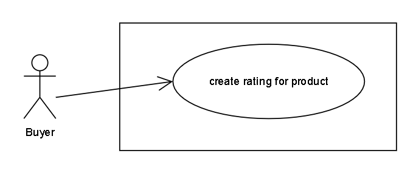

# RATING

With Rating, Buyer can rate any product that she thinks is good (1 -> 5 stars).

## Events

- Buyer create rating for product
  - ProductRated

## User Stories

- As a **Buyer**, I want to **rate for each product** that I think is good (1 -> 5 stars).

